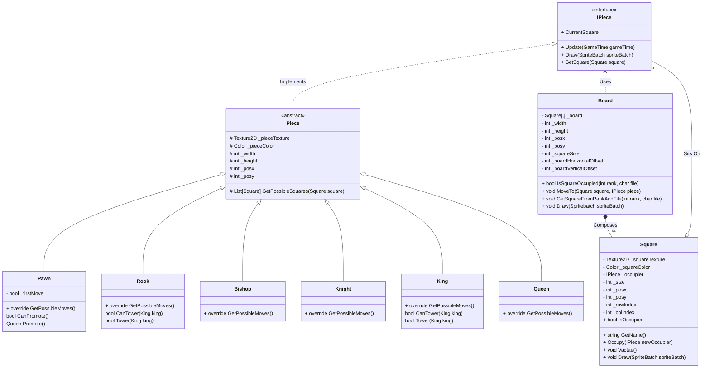

# MonoGame Chess

## Current Game State

The base checkerboard has been implemented. The board is an object of the `Board` class, which is composed of 64 `Square` class objects represented by a 2-dimentional `Square` array.

## Design

### UML Class Diagram

