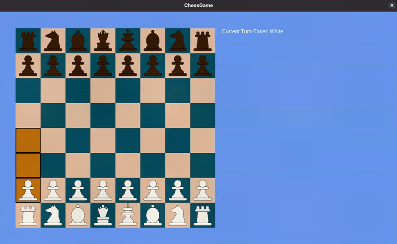

# MonoGame Chess

## Current Game State (Iteration 4)

Possible move highlighting is currently visible from pieces that would have a move in the initial state of the board - i.e. only Pawns and Knights can make a move; everyone else is blocked. To further implement and test possible moves for those pieces, either movement logic will need to be implemented (to move blocking pieces out of the way), or some sort of method that can temporarily remove pieces from the board.

In addition to possible move highlighting, a boarder has been introduced to highlighted squares, creating a visible boundary for each highlighted square. This will alow players to distinfuish beten adjecent squarece where they would like to place their piece on.

## Next Steps

Implement piece movement, with respect to their role in the game, and complete possible move highlighting for other pieces.

## Previous Iterations

### Iteration 3 - Possible Moves Highlighted Partially Implemented

Square selection has been implemented and restricted to the current Turn-Taker. Upon hovering over and clicking on the square that is occupied by a friendly piece, the square will be highlighted, on which the possible move squares will also be highlighted in a later iteration. If the user clicks anywhere else, other than the highlighted square, that square will become deselected.

Turn-takers can be force-switched by pressing the `Enter` key. This is a temporary feature, aimed to simulate turn-taking.

### Iteration 2 - Pieces Initialized and Rendered

All pieces render correctly in appropriate squares. A `PieceFactory` was implemented to allow the creation of different varieties of `IPiece` instances. Furthermore, checkerboard colours have been changed for easier visibility of the pieces.

### Iteration 1 - Checkerboard Completed

The checkerboard was produced through an `IBoard` interface, a `Board` container class object, and `Square` class objects, composing the board itself. This keeps all the board logic hidden behind the interface and separates board and square logic. The board is structured in a 2-dimensional array of `Square` objects, allowing for a more realistic manipulation of the board.

## Assets

| Asset | Source |
|:-|:-|
|Pieces|[Unknuffig - itch.io](https://unknuffig.itch.io/2d-chess-pices)|
