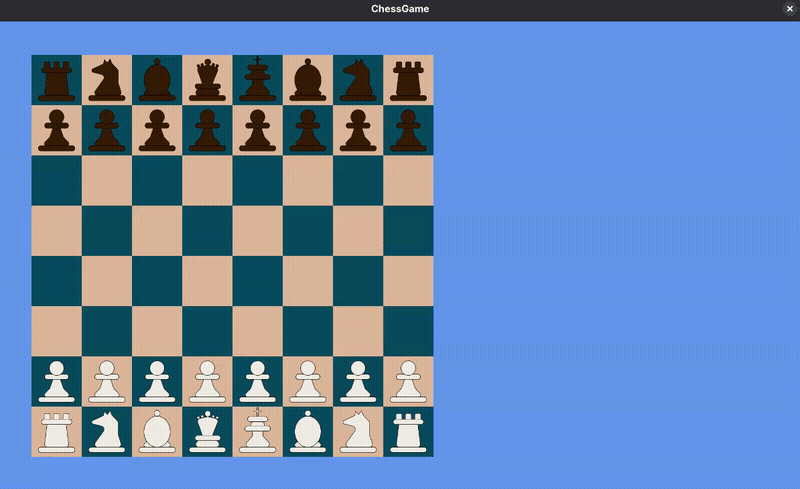
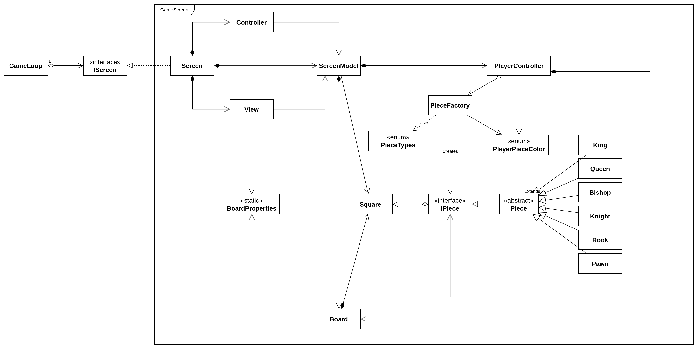
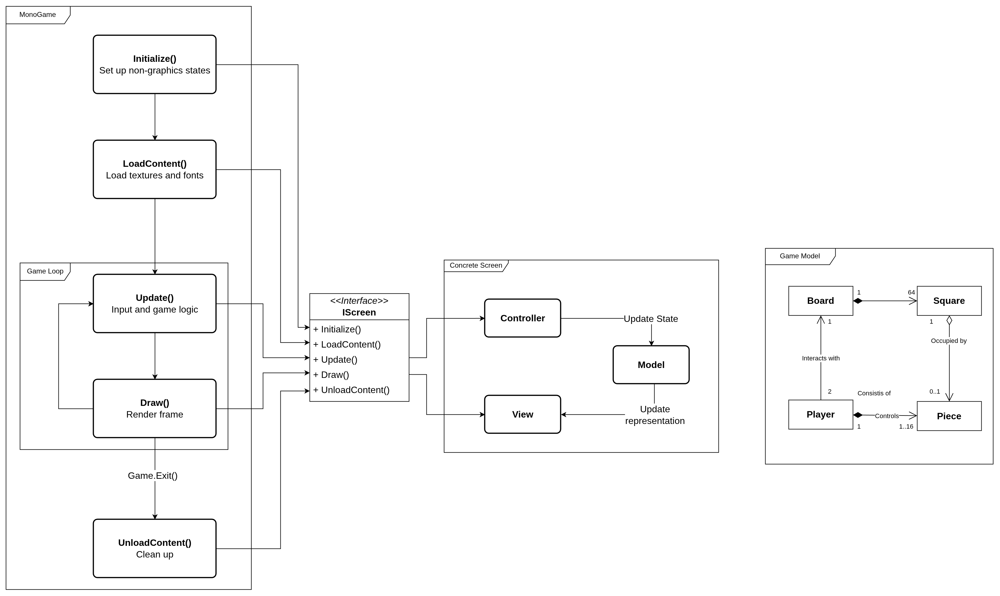
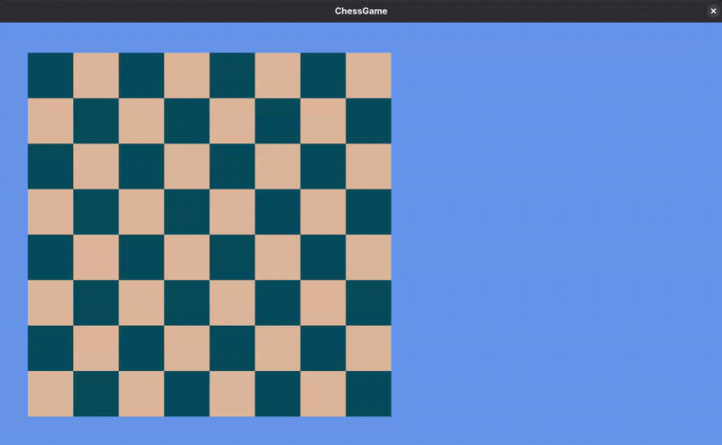

# MonoGame Chess

## Current Game State (Iteration 6)

Piece movement is in progress. Pawns are capable of pushing forward, with two possible moves on their first run. Knights also are capable of moving. However, move detection appears to be incomplete for both, since Knights can only move north and south, but not east and west. Pawns detec allied pieces as attacking moves. This will be an easy fix in further iterations. 

Looking at the game's design, shown below, several issues already exist - such as the `ScreenModel`, which is directly coupled with both the `Square` and `Board` objects, while the `Board` is supposed to manage the squares.

### Next Steps

- [IN PROGRESS] Implement piece movement, with respect to their role in the game, and complete possible move highlighting for other pieces.
- Loosen coupling where necessary/possible:
	- ModelScreen, Square, Board
	- PlayerController, PieceFactory, PlayerPieceColor
 	- PlayerController, Board
	- View, BoardProperties
	- Screen, ScreenModel

## Previous Iterations

## Iteration 5.3 - Move Detection Back In Place

Move detection has been brought to the same state as found in Iteration 4, and thus, the game state has been restored to how it was before Iteration 5.1. The only, negligible, difference is the absence of the label which indicated who is the current turn-taker.

### Iteration 5.2 - Piece Rendering Back In Place

Chess pieces are rendered on the board in appropriate initial positions. With the previous implementation, all pieces contained their own textures, which would have been assigned during the initialisation phase within the MonoGame engine. The problem with this was that the actual textures are loaded after initialisation into the `PieceFactory`, and as a consequence, pieces were built with `null` textures. This has been fixed by relocating the piece textures dictionary into `Screens.Game.View`, with an explicit method to load the textures into existing pieces using their new `TextureId` property.

### Iteration 5.1 - Architectural Redesign

The change to the game's architectural design is in the works. Previously, the game's structure was depicted using the diagram below:

```mermaid
classDiagram
    direction TB

    class GameLoop {
        <<Game>>
        -GraphicsDeviceManager _graphics
        -SpriteBatch _spriteBatch
        -IView _currentView
        +Initialize()
        +LoadContent()
        +Update(GameTime)
        +Draw(GameTime)
    }

    class IView {
        <<interface>>
        +LoadContent(GraphicsDevice, ContentManager)
        +Update(GameTime, MouseState, KeyboardState)
        +Draw(GameTime, SpriteBatch)
    }

    class GameView {
        -IBoard _board
        -PlayerController[] _controllers
        -SpriteFont _font
        -int _turn
        +LoadContent(GraphicsDevice, ContentManager)
        +Update(GameTime, MouseState, KeyboardState)
        +Draw(GameTime, SpriteBatch)
    }

    class IBoard {
        <<interface>>
        +IsSquareOccupied(char, int) bool
        +PlacePiece(Square, IPiece)
        +GetArray() Square[,]
        +Update(GameTime)
        +Draw(SpriteBatch)
        +OnSquareClicked(Square, PlayerController)
        +DeselectSquare()
        +GetSquareFromPixelPosition(int, int) Square
    }

    class Board {
        -Square[,] _board
        -Square _selectedSquare
        -List~Square~ _possibleMoves
        +OnSquareClicked(Square, PlayerController)
        +DeselectSquare()
        +IsSquareOccupied(char, int) bool
        +PlacePiece(Square, IPiece)
        +GetArray() Square[,]
        +GetSquareFromRankAndFile(int, char) Square
        +GetSquareFromPixelPosition(int, int) Square
        +Draw(SpriteBatch)
        -HighlightPossibleMovesFromSelectedSquare()
        -ClearHighlights()
    }
    note for Board "OnSquareClicked(): move-to-square branches\nare TODO stubs — only Console.WriteLine,\nno piece is actually moved yet"

    class PlayerController {
        -IBoard _board
        +PlayerPieceColor PieceColor
        +List~IPiece~ Pieces
        +int PawnCount
        +int RookCount
        +int KnightCount
        +int BishopCount
        +int QueenCount
        +int KingCount
        +int Score
        +int Points
        +Initialize()
        +ClickSquare(Square)
    }

    class Square {
        -Texture2D _squareTexture
        -bool _isHighlighted
        +bool IsOccupied
        +IPiece Occupant
        +int RowIndex
        +int ColumnIndex
        +int Size
        +int PosX
        +int PosY
        +GetName() string
        +Occupy(IPiece)
        +Vacate()
        +Highlight()
        +Unhighlight()
        +Draw(SpriteBatch)
    }

    class IPiece {
        <<interface>>
        +Square CurrentSquare
        +PlayerPieceColor PieceColor
        +int Value
        +GetPossibleMoves(IBoard) List~Square~
        +Update(GameTime)
        +Draw(SpriteBatch)
        +MoveTo(Square)
    }

    class Piece {
        <<abstract>>
        #PlayerPieceColor _playerPieceColor
        #Texture2D _texture
        #Square _currentSquare
        #int _direction
        +Value int
        +GetPossibleMoves(IBoard) List~Square~*
        +Update(GameTime)*
        +Draw(SpriteBatch)
        +MoveTo(Square)
    }

    class Pawn {
        -bool _firstMove
        -int _promotionRowIndex
        +GetPossibleMoves(IBoard) List~Square~
        +CanPromote() bool
        +Promote() IPiece
    }
    note for Pawn "GetPossibleMoves() implemented\nUpdate() and Promote() throw NotImplementedException"

    class Rook {
        -bool _canTower
        +GetPossibleMoves(IBoard) List~Square~
    }
    note for Rook "GetPossibleMoves() only scans its column\n(forward/backward) — rank movement missing\nUpdate() throws NotImplementedException"

    class Knight {
        +GetPossibleMoves(IBoard) List~Square~
    }
    note for Knight "GetPossibleMoves() only covers the\n±2 row / ±1 col L-shapes — the\n±1 row / ±2 col half is TODO\nUpdate() throws NotImplementedException"

    class Bishop {
        +GetPossibleMoves(IBoard) List~Square~
    }
    note for Bishop "GetPossibleMoves() stub — returns null\nUpdate() is a no-op"

    class Queen {
        +GetPossibleMoves(IBoard) List~Square~
    }
    note for Queen "GetPossibleMoves() stub — returns null\nUpdate() is a no-op"

    class King {
        +GetPossibleMoves(IBoard) List~Square~
    }
    note for King "GetPossibleMoves() stub — returns null\nUpdate() is a no-op"

    class PieceFactory {
        +Dictionary~string,Texture2D~ Textures$
        -PlayerPieceColor _playerPieceColor
        -int _direction
        -int _sideIndex
        -char _texturePrefix
        +CreatePiece(PieceTypes, Square) IPiece
    }

    class PieceTypes {
        <<enumeration>>
        Pawn
        Rook
        Knight
        Bishop
        Queen
        King
    }

    class PlayerPieceColor {
        <<enumeration>>
        White
        Black
    }

    class BoardProperties {
        <<static>>
        +int SquareSize$
        +int PosX$
        +int PosY$
        +Color CheckerColor1$
        +Color CheckerColor2$
        +Color SquareHighlightColor$
        +Color BorderColor$
    }

    GameLoop *-- "1" IView : _currentView
    GameView ..|> IView
    GameView *-- "1" IBoard : _board
    GameView *-- "2" PlayerController : _controllers
    Board ..|> IBoard
    Board *-- "64" Square : _board
    Board ..> PlayerController : OnSquareClicked(param)
    PlayerController --> IBoard : _board
    PlayerController "1" o-- "*" IPiece : Pieces
    PlayerController ..> PieceFactory : Initialize()
    Square "1" o-- "0..1" IPiece : Occupant
    Piece ..|> IPiece
    Pawn --|> Piece
    Rook --|> Piece
    Knight --|> Piece
    Bishop --|> Piece
    Queen --|> Piece
    King --|> Piece
    Piece --> PlayerPieceColor : _playerPieceColor
    PieceFactory ..> IPiece : creates
    PieceFactory --> PieceTypes
    Board ..> BoardProperties : uses
    Square ..> BoardProperties : uses
```

The goal in this iteration is to reorganise the game into cohesive components that make up the game, with the MonoGame engine being the main driver, while the MVC pattern handles management over a model and its graphical representation with the `View` component. The intended arhitectural design is as follows:

The `IScreen` interface allows for swappable screen contexts, which gives way to other screens such as "Settings".

In this iteratation, the board initialisation and drawing were implemented first. It also appeared that some functionalities have been preserved, thanks to the Object-Oriented design. More specifically, amid board initialisation, player controllers are also initialised which consequently initialise their own pieces and their original positions. This is recognised by the screen's draw method, however, since the logic for drawing piece sprites is not yet re-implemented, pieces do not appear on the board, despite the player is still capable of highlighting squares where those piecese are expected to be.

### Iteration 4 - Possible Move Highlighting

Possible move highlighting is currently visible from pieces that would have a move in the initial state of the board - i.e. only Pawns and Knights can make a move; everyone else is blocked. To further implement and test possible moves for those pieces, either movement logic will need to be implemented (to move blocking pieces out of the way), or some sort of method that can temporarily remove pieces from the board.

In addition to possible move highlighting, a boarder has been introduced to highlighted squares, creating a visible boundary for each highlighted square. This will alow players to distinfuish beten adjecent squarece where they would like to place their piece on.

### Iteration 3 - Possible Moves Highlighted Partially Implemented

Square selection has been implemented and restricted to the current Turn-Taker. Upon hovering over and clicking on the square that is occupied by a friendly piece, the square will be highlighted, on which the possible move squares will also be highlighted in a later iteration. If the user clicks anywhere else, other than the highlighted square, that square will become deselected.

Turn-takers can be force-switched by pressing the `Enter` key. This is a temporary feature, aimed to simulate turn-taking.

### Iteration 2 - Pieces Initialized and Rendered

All pieces render correctly in appropriate squares. A `PieceFactory` was implemented to allow the creation of different varieties of `IPiece` instances. Furthermore, checkerboard colours have been changed for easier visibility of the pieces.

### Iteration 1 - Checkerboard Completed

The checkerboard was produced through an `IBoard` interface, a `Board` container class object, and `Square` class objects, composing the board itself. This keeps all the board logic hidden behind the interface and separates board and square logic. The board is structured in a 2-dimensional array of `Square` objects, allowing for a more realistic manipulation of the board.

## Assets

| Asset | Source |
|:-|:-|
|Pieces|[Unknuffig - itch.io](https://unknuffig.itch.io/2d-chess-pices)|
