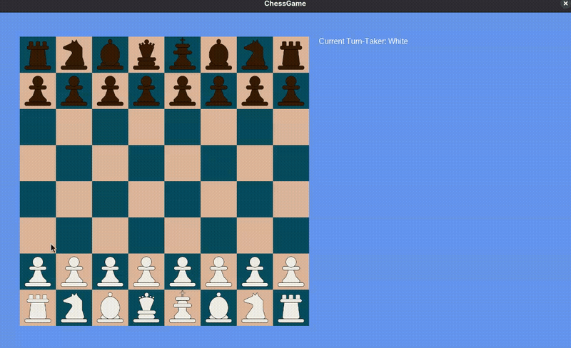
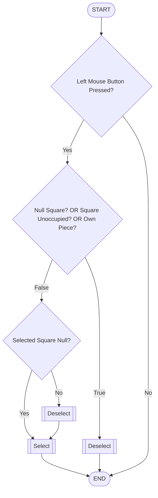
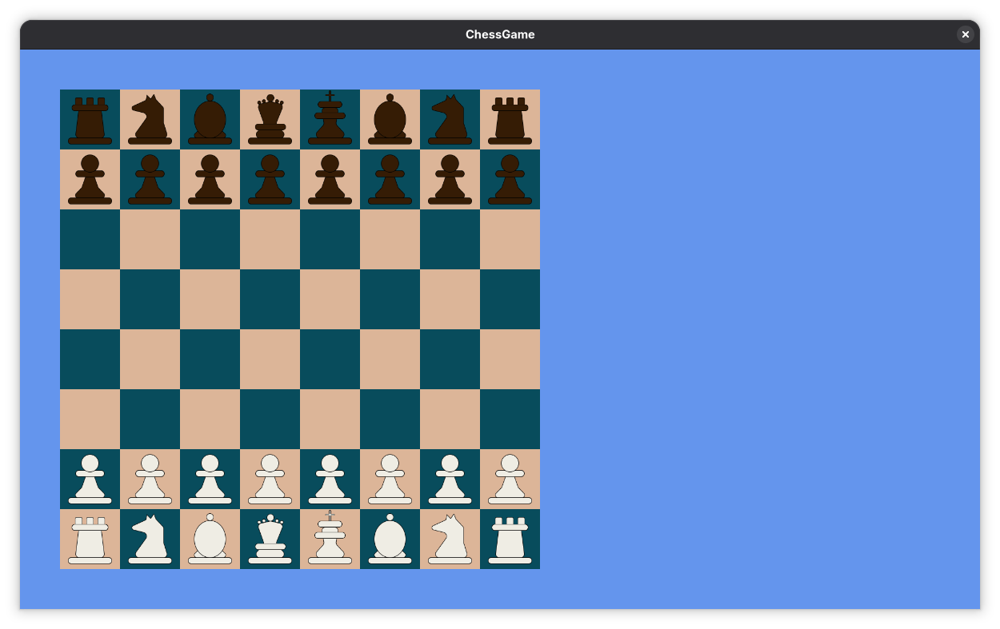
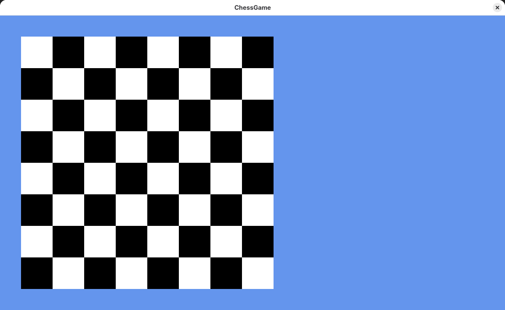

# MonoGame Chess

## Current Game State (Iteration 3)



Square selection has been implemented and restricted to the current Turn-Taker. Upon hovering over and clicking on the square that is occupied by a friendly piece, the square will be highlighted, on which the possible move squares will also be highlighted in a later iteration. If the user clicks anywhere else, other than the highlighted square, that square will become deselected.

Square selection control flow follows the diagram below:



Turn-takers can be force-switched by pressing the `Enter` key. This is a temporary feature, aimed to simulate turn-taking.

## Previous Iterations

### Oteration 2 - Pieces Initialized and Rendered



All pieces render correctly in appropriate squares. A `PieceFactory` was implemented to allow the creation of different varieties of `IPiece` instances. Furthermore, checkerboard colours have been changed for easier visibility of the pieces.

### Iteration 1 - Checkerboard Completed



The checkerboard was produced through an `IBoard` interface, a `Board` container class object, and `Square` class objects, composing the board itself. This keeps all the board logic hidden behind the interface and separates board and square logic. The board is structured in a 2-dimensional array of `Square` objects, allowing for a more realistic manipulation of the board.

[//]: # (## Design)

[//]: # (### UML Class Diagram)

[//]: # (```mermaid)

[//]: # (classDiagram)

[//]: # (    class IPiece <<interface>>)

[//]: # (    IPiece : + CurrentSquare)

[//]: # (    IPiece : + Update&#40;GameTime gameTime&#41;)

[//]: # (    IPiece : + Draw&#40;SpriteBatch spriteBatch&#41;)

[//]: # (    IPiece : + SetSquare&#40;Square square&#41;)

[//]: # (    )
[//]: # (    class Piece <<abstract>>)

[//]: # (    Piece : # Texture2D _pieceTexture)

[//]: # (    Piece : # Color _pieceColor)

[//]: # (    Piece : # int _width)

[//]: # (    Piece : # int _height)

[//]: # (    Piece : # int _posx)

[//]: # (    Piece : # int _posy)

[//]: # (    Piece : # List[Square] GetPossibleSquares&#40;Square square&#41;)

[//]: # (    )
[//]: # (    class Board)

[//]: # (    Board : - Square[,] _board)

[//]: # (    Board : - int _width)

[//]: # (    Board : - int _height)

[//]: # (    Board : - int _posx)

[//]: # (    Board : - int _posy)

[//]: # (    Board : - int _squareSize)

[//]: # (    Board : - int _boardHorizontalOffset)

[//]: # (    Board : - int _boardVerticalOffset)

[//]: # (    Board : + bool IsSquareOccupied&#40;int rank, char file&#41;)

[//]: # (    Board : + void MoveTo&#40;Square square, IPiece piece&#41;)

[//]: # (    Board : + void GetSquareFromRankAndFile&#40;int rank, char file&#41;)

[//]: # (    Board : + void Draw&#40;Spritebatch spriteBatch&#41;)

[//]: # (    )
[//]: # (    class Square)

[//]: # (    Square : - Texture2D _squareTexture)

[//]: # (    Square : - Color _squareColor)

[//]: # (    Square : - IPiece _occupier)

[//]: # (    Square : - int _size)

[//]: # (    Square : - int _posx)

[//]: # (    Square : - int _posy)

[//]: # (    Square : - int _rowIndex)

[//]: # (    Square : - int _colIndex)

[//]: # (    Square : + bool IsOccupied)

[//]: # (    Square : + string GetName&#40;&#41;)

[//]: # (    Square : + Occupy&#40;IPiece newOccupier&#41;)

[//]: # (    Square : + void Vactae&#40;&#41;)

[//]: # (    Square : + void Draw&#40;SpriteBatch spriteBatch&#41;)

[//]: # ()
[//]: # (    class Pawn)

[//]: # (    Pawn : - bool _firstMove)

[//]: # (    Pawn : + override GetPossibleMoves&#40;&#41;)

[//]: # (    Pawn : bool CanPromote&#40;&#41;)

[//]: # (    Pawn : Queen Promote&#40;&#41;)

[//]: # (    )
[//]: # (    class Rook)

[//]: # (    Rook : + override GetPossibleMoves&#40;&#41;)

[//]: # (    Rook : bool CanTower&#40;King king&#41;)

[//]: # (    Rook : bool Tower&#40;King king&#41;)

[//]: # (    )
[//]: # (    class Knight)

[//]: # (    Knight : + override GetPossibleMoves&#40;&#41;)

[//]: # (    )
[//]: # (    class Bishop)

[//]: # (    Bishop : + override GetPossibleMoves&#40;&#41;)

[//]: # (    )
[//]: # (    class King)

[//]: # (    King : + override GetPossibleMoves&#40;&#41;)

[//]: # (    King : bool CanTower&#40;King king&#41;)

[//]: # (    King : bool Tower&#40;King king&#41;)

[//]: # (    )
[//]: # (    class Queen)

[//]: # (    Queen : + override GetPossibleMoves&#40;&#41;)

[//]: # ()
[//]: # ()
[//]: # (    IPiece <|.. Piece : Implements)

[//]: # (    IPiece <.. Board : Uses)

[//]: # (    Board *-- "64" Square : Composes)

[//]: # (    Square o-- "0..1" IPiece : Sits On)

[//]: # (    Piece <|-- Pawn)

[//]: # (    Piece <|-- Rook)

[//]: # (    Piece <|-- Bishop)

[//]: # (    Piece <|-- Knight)

[//]: # (    Piece <|-- King)

[//]: # (    Piece <|-- Queen)

[//]: # (```)